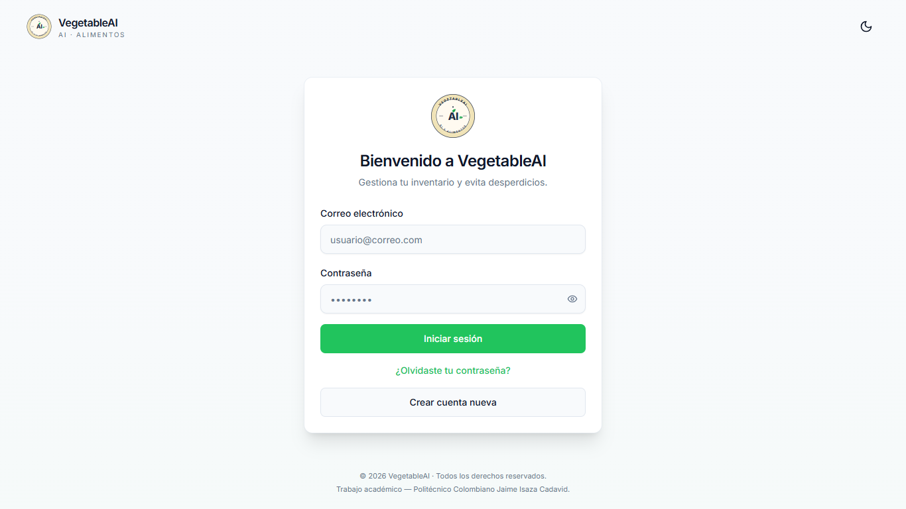
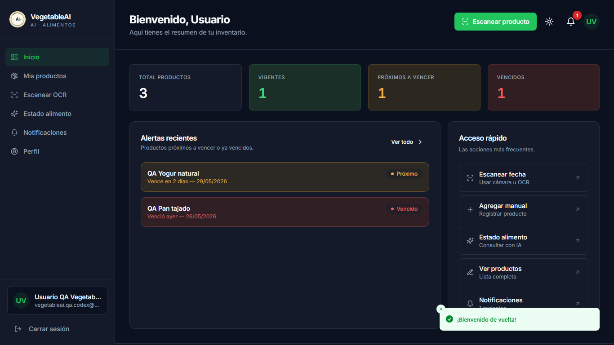
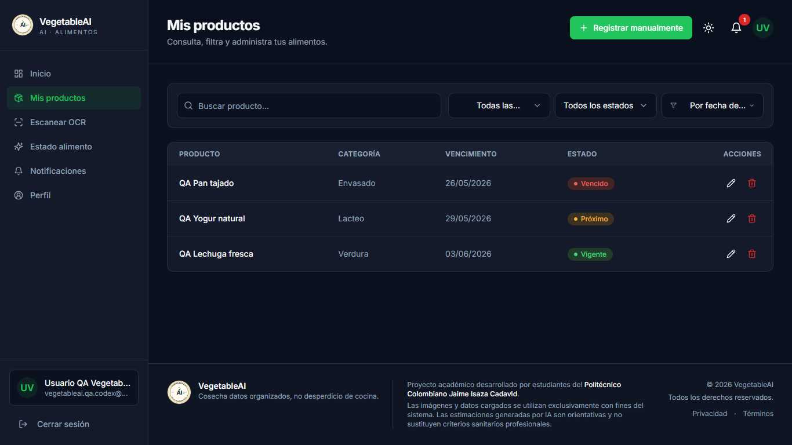
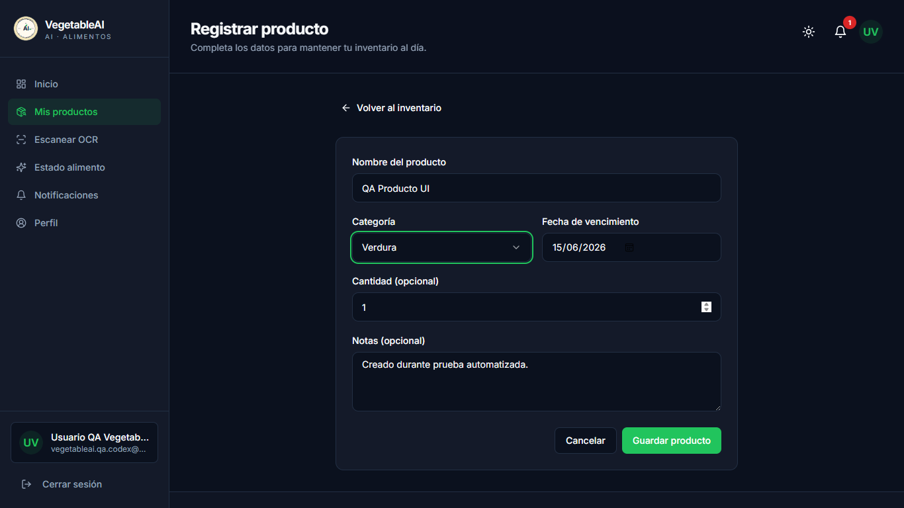
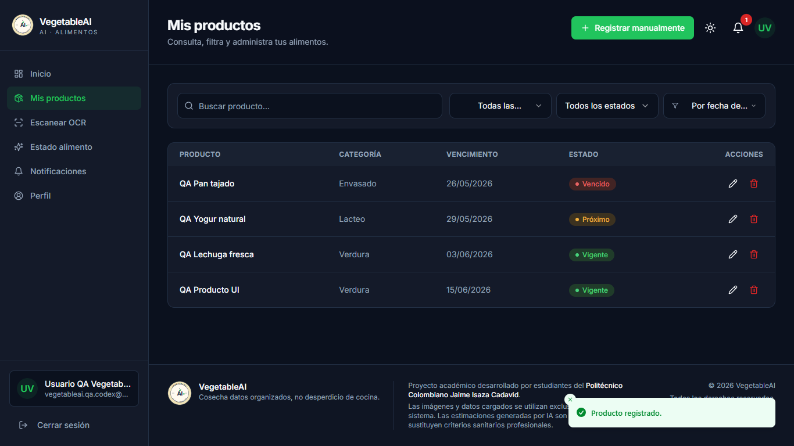
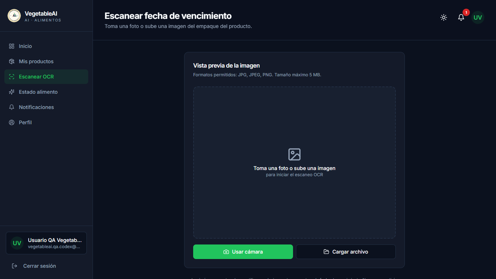
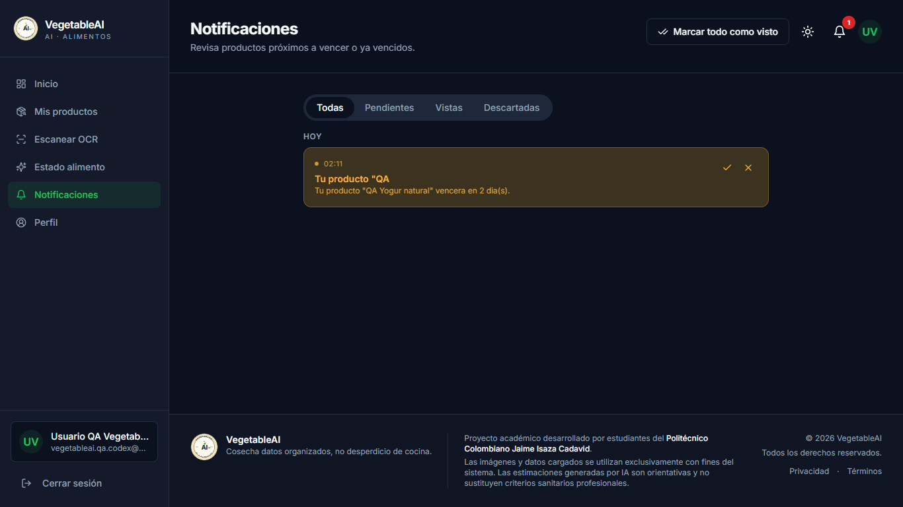
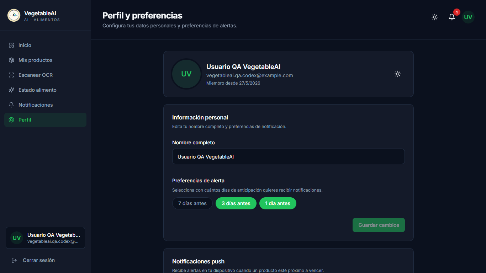
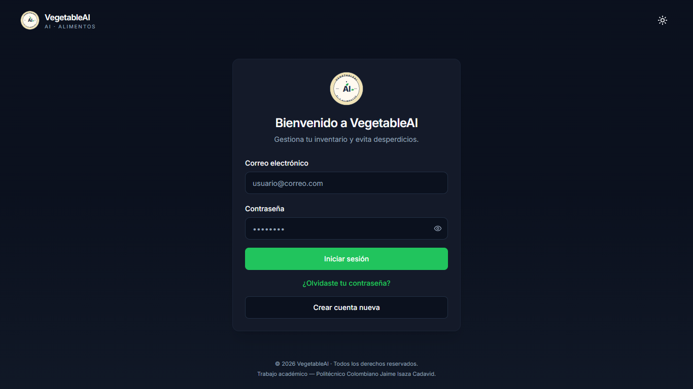

# VegetableAI - README de pruebas

Fecha de ultima ejecucion: 2026-05-27  
Frontend probado: http://127.0.0.1:5173  
Backend probado: http://localhost:3000/api  
Usuario QA: `vegetableai.qa.codex@example.com`

## Resumen ejecutivo

Se repitio el plan con pruebas dentro de la app usando una sesion real de Supabase. Para esto se preparo un usuario QA confirmado, un perfil, productos de inventario y una alerta asociada.

Resultado general: PASSED.

| Area | Resultado |
| --- | --- |
| Login publico | PASSED |
| Proteccion de rutas sin sesion | PASSED |
| Login real con Supabase | PASSED |
| Dashboard autenticado | PASSED |
| Inventario autenticado con datos reales | PASSED |
| Creacion de producto desde UI | PASSED |
| Scanner autenticado | PASSED |
| Alertas autenticadas | PASSED |
| Perfil autenticado | PASSED |
| Cierre de sesion con confirmacion | PASSED |
| Backend protegido con Bearer token activo | PASSED |
| Backend protegido sin token | PASSED |

## Configuracion usada

### Backend

`backend/.env` contiene las variables privadas de servidor:

```env
SUPABASE_URL=...
SUPABASE_SERVICE_ROLE_KEY=...
PORT=3000
```

### Frontend

`frontend/.env.local` contiene solo configuracion segura para cliente:

```env
VITE_SUPABASE_URL=https://ipilxeriauwvohbudtod.supabase.co
VITE_SUPABASE_ANON_KEY=sb_publishable_aobMMshblOZdAlar4-b9Mg_Y0fpTdDE
VITE_PORT=3000
```

Nota: no se agrego `VITE_SUPABASE_SERVICE_ROLE_KEY` al frontend porque cualquier variable `VITE_*` queda expuesta en el navegador. La service role key debe permanecer solo en backend.

## Datos QA preparados

El script de pruebas crea o actualiza el usuario QA `vegetableai.qa.codex@example.com`, confirma su email y prepara datos limpios para cada ejecucion:

| Recurso | Datos |
| --- | --- |
| Perfil | Usuario QA VegetableAI |
| Productos iniciales | QA Lechuga fresca, QA Yogur natural, QA Pan tajado |
| Alerta | Alerta pendiente para QA Yogur natural |
| Producto creado por UI | QA Producto UI |

## Pruebas con pantallazos

### 1. Carga de login

Resultado: PASSED  
URL: http://127.0.0.1:5173/login



### 2. Proteccion de `/dashboard` sin sesion

Resultado: PASSED  
Detalle: sin sesion, `/dashboard` redirige a `/login`.


### 3. Inicio de sesion real

Resultado: PASSED  
Detalle: login con usuario QA confirmado y navegacion exitosa a dashboard.



### 4. Inventario autenticado

Resultado: PASSED  
Detalle: la vista lista productos reales del usuario QA desde backend/Supabase.



### 5. Formulario de producto diligenciado

Resultado: PASSED  
Detalle: se llenan campos del formulario dentro de la app antes de guardar.



### 6. Creacion de producto desde UI

Resultado: PASSED  
Detalle: el producto `QA Producto UI` aparece en inventario despues de guardar.



### 7. Scanner OCR autenticado

Resultado: PASSED  
Detalle: la pantalla de scanner se abre dentro de sesion autenticada.



### 8. Alertas autenticadas

Resultado: PASSED  
Detalle: la vista de alertas muestra la alerta preparada para el usuario QA.



### 9. Perfil autenticado

Resultado: PASSED  
Detalle: la vista de perfil abre dentro de la sesion real del usuario QA.



### 10. Cierre de sesion

Resultado: PASSED  
Detalle: la app muestra confirmacion y vuelve a login despues de cerrar sesion.



## Pruebas API

### Backend publico: VAPID public key

Resultado: PASSED

```http
GET http://localhost:3000/api/notifications/vapid-public-key
```

Respuesta: HTTP 200.

### Backend protegido: inventario sin token

Resultado: PASSED

```http
GET http://localhost:3000/api/inventory
```

Respuesta esperada: HTTP 401.

### Backend protegido: inventario con token de sesion activa

Resultado: PASSED

```http
GET http://localhost:3000/api/inventory
Authorization: Bearer <token de la sesion QA>
```

Respuesta esperada: HTTP 200 con productos del usuario QA.

## Compilacion

Build frontend: PASSED.

```text
vite v5.4.21 building for production...
2714 modules transformed.
OK built
```


## Observaciones

- No hubo errores de consola durante la ejecucion autenticada final.
- No hubo requests fallidos reportados por Playwright.
- Las notificaciones push siguen mostrando advertencia en backend porque no hay `VAPID_PUBLIC_KEY` ni `VAPID_PRIVATE_KEY`.
- El script deja datos QA controlados en Supabase para permitir pruebas repetibles.

## Archivos generados o actualizados

- `frontend/.env.local`
- `TEST_RESULTS_README.md`
- `test-results/results.json`
- `test-results/screenshots/*.png`
- `.tools/run-app-tests.mjs`

